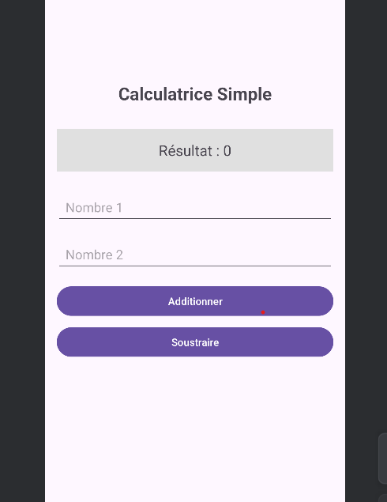

# Atelier Android - Interfaces Utilisateur

## 
Étudiant - **Nom:** Youness - **Date:** 2025/11/7

## 
Exercices réalisés

### Exercice 1 : Calculatrice (LinearLayout) -
✅
Interface avec LinearLayout -
✅
Opérations d'addition et soustraction -
✅
Validation des entrées

### Exercice 2 : Profil Utilisateur (ConstraintLayout) -
✅
Interface avec ConstraintLayout -
✅
Formulaire de profil -
✅
Mise à jour des informations

### Challenge : Application de Contact
- 
✅
Formulaire complet avec tous les champs -
✅
RadioButtons pour catégories -
✅
Validation complète -
✅
Affichage formaté -
✅
Fonction de réinitialisation

## 

Captures d'écran

## 

Ce que j'ai appris :
Utilisation de ConstraintLayout
Navigation entre activites
Gestion des evenements en Kotlin

