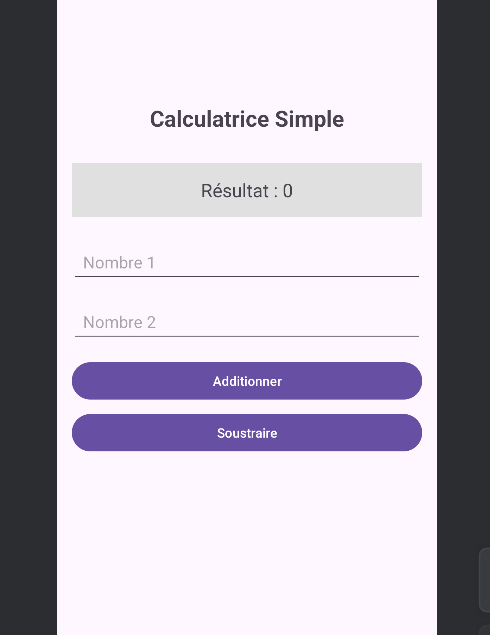

# Atelier Android - Interfaces Utilisateur 
 
## 

 Étudiant - **Nom:** Youness Ainzar - **Date:** 2025/11/7 
 
## 

 Exercices réalisés 
 
### Exercice 1 : Calculatrice (LinearLayout) - 
✅Interface avec LinearLayout  
✅Opérations d'addition et soustraction  
✅Validation des entrées  
 
### Exercice 2 : Profil Utilisateur (ConstraintLayout) - 
✅
 Interface avec ConstraintLayout  
✅
 Formulaire de profil  
✅
 Mise à jour des informations  
 
### Challenge : Application de Contact 
 - 
✅
 Formulaire complet avec tous les champs  
✅
 RadioButtons pour catégories  
✅
 Validation complète  
✅
 Affichage formaté  
✅
 Fonction de réinitialisation 
 
## 

 Captures d'écran 
### Calculatrice 
 
 
### Profil Utilisateur 
 
 
### Challenge Contact 

## Ce que j'ai appris - 
 Utilisation de ConstraintLayout 
 Navigation entre activites 
 Gestion des evenements en Kotlin 

## 

 Difficultés rencontrées
